#Tags #BEJSON #BrowserEditor #MFDB

## Title: Modern BEJSON Editor (104-Only Build)

> Single-file, zero-dependency browser editor and visual spreadsheet grid for BEJSON (104/104a) documents and MFDB manifests/entities.

[]()
[]()
[]()
[]()
[]()

---

## Credits

**Author & Project Creator:** Elton Boehnen  
**Email:** [boehnenelton2024@gmail.com](mailto:boehnenelton2024@gmail.com)  
**Website:** [boehnenelton2024.pages.dev](https://boehnenelton2024.pages.dev)  
**GitHub:** [github.com/boehnenelton](https://github.com/boehnenelton)  
**Format Creator & Maintainer:** Elton Boehnen  
**Document Fingerprint / Relational ID:** `324fdeff-4d40-40a6-b8d4-fbd8b9b8553f`  

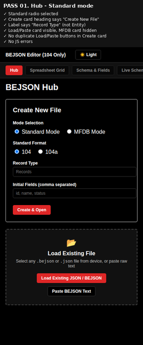


---

## Table of Contents

- [Introduction](#introduction)
- [Context Clarification & Naming Heritage](#context-clarification--naming-heritage)
- [Breakdown](#breakdown)
  - [Essence & Purpose](#essence--purpose)
  - [Primary & Abstract Use Cases](#primary--abstract-use-cases)
- [Feature List](#feature-list)
- [Usage Guide](#usage-guide)
  - [Header Toolbar Layout](#header-toolbar-layout)
  - [Loading Files & MFDB Directories](#loading-files--mfdb-directories)
  - [Grid & Context Menu Operations](#grid--context-menu-operations)
- [System Architecture & Topology](#system-architecture--topology)
- [Prerequisites & System Requirements](#prerequisites--system-requirements)
- [Installation & Local Setup](#installation--local-setup)
- [Configuration & Header Reference](#configuration--header-reference)
- [UI & Keyboard Shortcuts Reference](#ui--keyboard-shortcuts-reference)
- [Performance & Strict CSP Security](#performance--strict-csp-security)
- [Troubleshooting & FAQ](#troubleshooting--faq)
- [Security Policy & Data Integrity](#security-policy--data-integrity)
- [Development & Contribution Guidelines](#development--contribution-guidelines)
- [Closing Summary](#closing-summary)
- [Polyglot License](#polyglot-license)

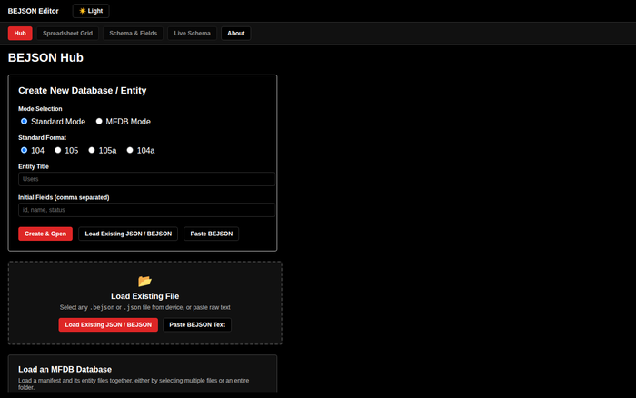


---

## Introduction

The **Modern BEJSON Editor (104-Only Build)** is a lightweight, single-file HTML web application engineered to view, edit, validate, and structure BEJSON (104 and 104a) documents and Multi-File Database (MFDB v1.31) manifests and entities directly within any modern web browser.

Designed for local-first execution, privacy, and zero external dependencies, this editor runs seamlessly without a backend application server, Node daemon, or remote database connection. It provides a visual spreadsheet-style grid for record editing, custom header management, raw JSON inspection, strict validation reporting, cell/row Web Crypto AES-GCM encryption, and full File System Access API integration for live file mounting.

---

## Context Clarification & Naming Heritage

To prevent acronym ambiguity across documentation and tooling:
- **BEJSON:** Stands explicitly for **BOEHNEN ELTON JSON** (named after format creator Elton Boehnen). It is a strict, self-describing tabular data serialization format enforcing positional integrity.
- **MFDB:** Stands explicitly for **MULTI FILE DATABASE**. It is an architectural database specification that orchestrates individual BEJSON files (manifests and entity files) into a federated local database structure.

---

## Breakdown

### Essence & Purpose
The project is a **Standalone Client-Side Web Tool** delivered as a single portable `.html` file. It eliminates complex web framework stacks in favor of high-performance vanilla JavaScript, strict Content-Security-Policy (CSP) headers, and raw DOM manipulation.

### Primary & Abstract Use Cases

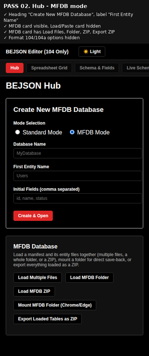


#### 1. General / Primary Use Case
- **BEJSON 104/104a Document Editing:** Inspect, modify, add, and delete records and field schemas within standard BEJSON files.
- **MFDB Database Management:** Load a database manifest (`104a.mfdb.bejson`) along with its target entity files, resolve record counts, validate structural rules, and export modified databases as a structured ZIP archive.

#### 2. Advanced / Abstract Use Case
- **Local Disk Live-Mounting:** Link a local directory on disk via the browser's File System Access API so edits save directly back to the original files without triggering browser downloads.
- **Air-Gapped Privacy & Cryptography:** Perform client-side AES-GCM encryption on individual cells or entire records using PBKDF2 key derivation without transmitting data across a network.

---

## Feature List

- 📊 **Spreadsheet Grid Editor:** High-density table interface featuring real-time input binding, multi-select record checkboxes, column sorting, and instant search filtering.
- 💾 **Front-Loaded Toolbar Controls:** `💾 Save`, `Save As…`, and `📂 Load` are prominently positioned after the title, ensuring instant access across both the Hub and Editor tabs.
- 🌙 **Theme & Interface Control:** Smooth dark/light theme toggle anchored to the far right toolbar edge with persistent local storage theme preferences.
- 🗑️ **Irreversible Action Warnings:** Context-menu record and column deletions trigger clear, explicit confirm dialogs warning that field deletions remove the entire column across all records.
- 📂 **Hub Open Files Panel:** Dedicated Hub interface displaying active open file indicators, browser-visible file/mounted paths, unsaved change alerts, and one-click table switching.
- 🔒 **Client-Side AES-GCM Encryption:** Encrypt and decrypt sensitive cell values or complete records using Web Crypto (256-bit AES-GCM, 100k PBKDF2 iterations).
- 📦 **MFDB Multi-File & ZIP Engine:** Load multiple files, entire folders, or ZIP containers with built-in CRC32 verification and automated ZIP export.
- 🛡️ **Strict Hash-Only CSP:** Enforces Content Security Policy with zero `'unsafe-inline'` script access, locked to a SHA-256 script hash with an automatic Python re-stamping daemon.

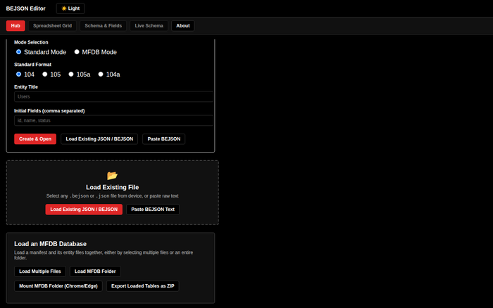


---

## Usage Guide

### Header Toolbar Layout

The header toolbar provides direct control across all loaded documents:

- **💾 Save (Ctrl+S / Cmd+S):** Immediately writes changes to the mounted file handle or triggers a browser download.
- **Save As…:** Prompts for a new file name or opens native file save pickers.
- **📂 Load:** Opens local `.bejson` or `.json` files.
- **Table Selector:** Switches active context between loaded manifest and entity tables.
- **☀️ Light / 🌙 Dark:** Toggles theme state instantly.

### Loading Files & MFDB Directories

1. **Standard File Loading:** Click **📂 Load** on the header toolbar or drag-and-drop a `.bejson` file into the Hub dropzone.
2. **MFDB Folder Mounting (Chrome/Edge):** Switch to **MFDB Mode** on the Hub, click **Mount Folder**, select your database folder, and edit files in place.

### Grid & Context Menu Operations

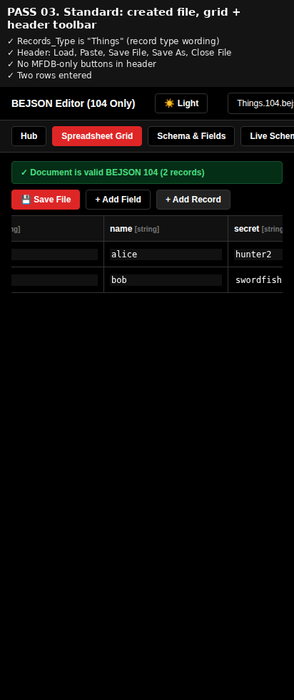


- **Right-Click / Long-Press on Cell:** Opens advanced cell editor, clipboard copy/paste, cell encryption/decryption, **🗑 Delete Record**, and **🗑 Delete Field (Column)**.
- **Header Field Click:** Edits field names, data types, or deletes field columns across all rows.

---

## System Architecture & Topology

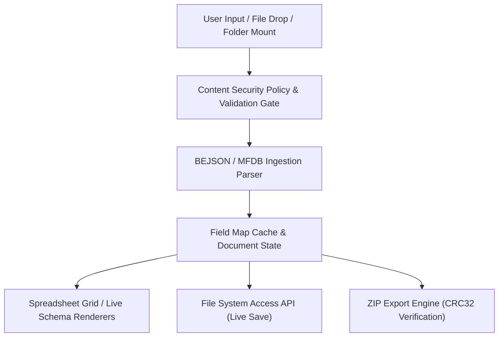

---

## Prerequisites & System Requirements

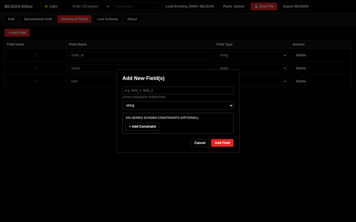


| Requirement Category | Minimum Specification | Recommended Specification |
| :--- | :--- | :--- |
| **Supported Browsers** | Chrome 86+, Edge 86+, Firefox 90+, Safari 14+ | Chrome / Edge (for File System Access API) |
| **Operating System** | Android (Termux), Linux, macOS, Windows | Any OS with a modern browser |
| **Network Connection** | Offline / Air-Gapped | Fully functional offline with zero network requests |
| **Python (Dev Tooling)** | Python 3.10+ (for `stamp_csp.py`) | Python 3.12+ |

---

## Installation & Local Setup

### Option 1: Direct Browser Launch (No Installation Required)

Simply open `Modern_BEJSON_Editor_104_ONLY.html` directly in any web browser:

```bash
# On Termux / Android:
termux-open Modern_BEJSON_Editor_104_ONLY.html

# On Linux / macOS / WSL:

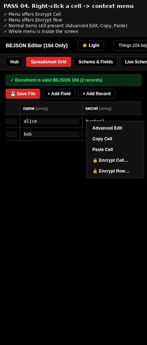

xdg-open Modern_BEJSON_Editor_104_ONLY.html
```

### Option 2: Serving Locally via HTTP

```bash
cd /storage/emulated/0/Admin/dev/Web/Modern_Vanilla_BEJSON-Editor
python3 -m http.server 8080
# Open http://localhost:8080/Modern_BEJSON_Editor_104_ONLY.html in browser
```

---

## Configuration & Header Reference

BEJSON 104a custom top-level headers are managed cleanly via the **Custom Headers** editor, preserving positional serialization:

| Header Name | Type | Description |
| :--- | :--- | :--- |
| `Format` | `String` | Fixed format string (`"BEJSON"`) |
| `Format_Version` | `String` | Version identifier (`"104"` or `"104a"`) |
| `Format_Creator` | `String` | Author attribution (`"Elton Boehnen"`) |
| `Records_Type` | `Array[String]` | Declared record array classification |
| `Fields` | `Array[Object]` | Ordered array of field names and data types |
| `Values` | `Array[Array]` | Matrix of record values |

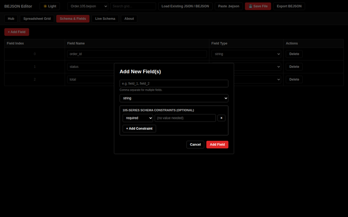


---

## UI & Keyboard Shortcuts Reference

- `Ctrl + S` / `Cmd + S`: Save active document immediately.
- `Escape`: Close open modal dialogs or encryption password popups.
- `Right-Click / Long-Press`: Trigger context menu options on grid rows, cells, and field headers.

---

## Performance & Strict CSP Security

- **Zero Inline Event Handlers:** All 28 static and dynamic buttons use delegated event listeners.
- **Strict Content-Security-Policy:**
  ```http
  Content-Security-Policy: default-src 'none'; script-src 'sha256-...'; script-src-attr 'none'; style-src 'unsafe-inline'; img-src data: blob:; font-src data:; connect-src 'none';

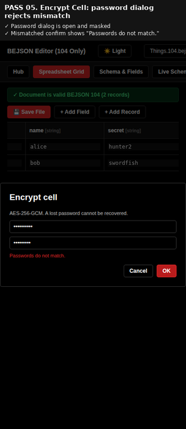

  ```
- **CSP Re-Stamping Tool:** Included daemon script `dev/stamp_csp.py` re-stamps script hashes automatically after code updates.

---

## Troubleshooting & FAQ

<details>
<summary><strong>Q: Why does a "script did not start" warning appear on load?</strong></summary>

*A: The script hash modified during editing does not match the CSP meta header. Re-stamp the hash:*
```bash
python3 dev/stamp_csp.py Modern_BEJSON_Editor_104_ONLY.html
```
</details>

<details>
<summary><strong>Q: Why is Mount Folder disabled in Firefox or Safari?</strong></summary>

*A: The File System Access API (`showDirectoryPicker`) is currently supported in Chromium-based browsers (Chrome, Edge, Opera). Firefox and Safari fall back to standard file import and download saving.*
</details>

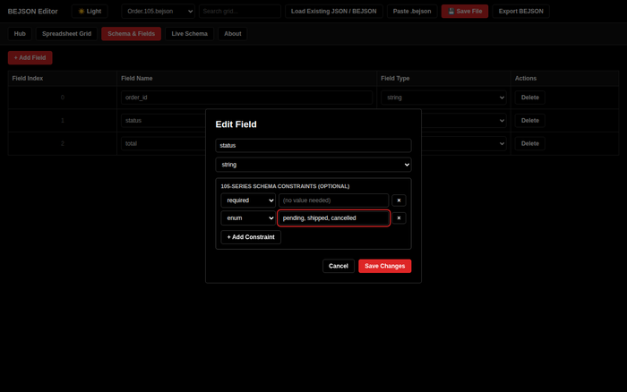


---

## Security Policy & Data Integrity

- **Zero Telemetry:** The application makes zero HTTP network requests (`connect-src 'none'`).
- **Web Crypto Encryption:** Sensitive rows and cells are protected using AES-GCM with 100,000 PBKDF2 iterations.
- **Boundary Validation:** Ingested documents pass through boundary-layer key sanitization and strict prototype protection (`__proto__` / `constructor` guards).

---

## Development & Contribution Guidelines

1. **Script Hash Maintenance:** Always execute `dev/stamp_csp.py Modern_BEJSON_Editor_104_ONLY.html` after editing JavaScript code.
2. **Version Parity:** Maintain single-source-of-truth version variables (`VERSION` and `PACKAGE_VERSION`) in code and sync with `bejson_project.json`.
3. **Checklist Protocol:** Record all major feature implementations in `dev/checklist-<timestamp>.md` prior to code modifications.

---

## Closing Summary

The **Modern BEJSON Editor (104-Only Build)** delivers a robust, secure, and privacy-focused environment for managing local data structures and MFDB databases. It stands as a production-ready, dependency-free reference implementation of Elton Boehnen's BEJSON format specifications.

---

## Polyglot License

This repository is distributed under a **Polyglot Open-Source License Model** to maximize interoperability across programming runtimes, technical documentation channels, and local-first data specifications:

- **Source Code & Web Application Logic (HTML, JavaScript, CSS):** Dual-licensed under the [MIT License](LICENSE) and [Apache 2.0 License](LICENSE-APACHE). Users may choose either license at their option.
- **Documentation & Technical Guides:** Licensed under [Creative Commons Attribution 4.0 International (CC-BY 4.0)](https://creativecommons.org/licenses/by/4.0/).
- **BEJSON & Data Format Specifications:** Placed in the [Public Domain (CC0 1.0 Universal)](https://creativecommons.org/publicdomain/zero/1.0/) for unrestricted ecosystem adoption and zero-lock-in integration.

**Maintainer & Copyright:**  
© 2026 Elton Boehnen · [boehnenelton2024@gmail.com](mailto:boehnenelton2024@gmail.com) · [boehnenelton2024.pages.dev](https://boehnenelton2024.pages.dev) · [github.com/boehnenelton](https://github.com/boehnenelton)

---

*Documentation maintained by Elton Boehnen · [boehnenelton2024.pages.dev](https://boehnenelton2024.pages.dev)*
